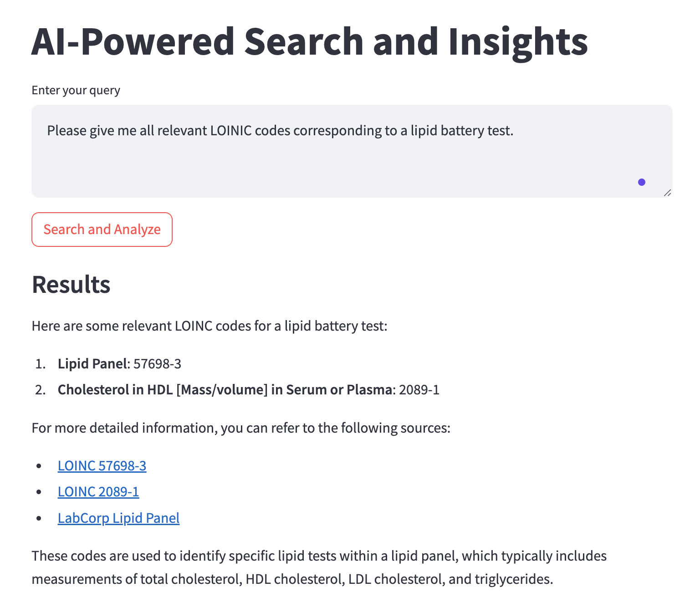

# Agentic Search with OpenAI and LangGraph

This repository enables AI-powered search and insights generation using LangGraph and OpenAI's GPT-4o, leveraging both Tavily and DuckDuckGo search tools. The project facilitates intelligent web searching and content processing to provide insightful responses based on user queries.

## Table of Contents
- [Introduction](#introduction)
- [Features](#features)
- [Installation](#installation)
- [Configuration](#configuration)
- [Usage](#usage)
- [Project Structure](#project-structure)
- [Contributing](#contributing)
- [License](#license)

## Introduction
This project integrates various tools and agents to perform web searches and generate insights. It uses LangGraph for state management and OpenAI's GPT-4o for natural language processing. The search functionality is powered by Tavily and DuckDuckGo, providing flexibility and robustness in obtaining information from the web.

## Features
- **Web Search:** Perform web searches using Tavily or DuckDuckGo.
- **Content Processing:** Process and extract text from web pages.
- **Insight Generation:** Generate insights based on the processed content.
- **State Management:** Use LangGraph for managing states and workflows.
- **Streamlit and Gradio Interfaces:** User interfaces for interaction.

## Installation
To get started, clone the repository and install the required dependencies:
```bash
git clone https://github.com/yourusername/agentic_search_openai_langgraph.git
cd agentic_search_openai_langgraph
pip install -r requirements.txt
```

## Configuration
Create a `.env` file in the root directory of the project and add your API keys and other configuration details. You can use the `.env.example` file as a template:
```bash
cp .env.example .env
```

Edit the `.env` file to include your API keys:
```plaintext
LANGCHAIN_TRACING_V2=true
LANGCHAIN_ENDPOINT=https://api.smith.langchain.com
LANGCHAIN_API_KEY=your_langchain_api_key
LANGCHAIN_PROJECT=your_langchain_project
OPENAI_API_KEY=your_openai_api_key
TAVILY_API_KEY=your_tavily_api_key
```

### Configuration in `tools.py`

In `tools.py`, you can configure which search tool to use by modifying the `get_tools` function:

```python
def get_tools():
    # return [internet_search]   # Uncomment this and comment the line below to use Tavily instead of DuckDuckGo Search.
    return [internet_search_DDGO, process_content]  # Uncomment this and comment the line above to use DuckDuckGo Search instead of Tavily.
```

## Usage

### Streamlit Interface
To run the Streamlit application:
```bash
streamlit run app_st.py
```
This will launch a web interface where you can enter your query and get insights.

#### Example of Streamlit App in Action

Here is an example of the Streamlit application in action:




### Gradio Interface
To run the Gradio application:
```bash
python main.py
```
This will launch a Gradio interface for interaction.

## Project Structure
```
agentic_search_openai_langgraph
├── .env.example            # Example environment configuration file.
├── agents.py               # Defines the agents and their behaviors.
├── app_steamlit.py         # Streamlit application for user interaction.
├── graph.py                # Manages the state graph and workflow execution.
├── app_gradio.py           # Gradio application for user interaction.
├── readme.md               # Project README file.
├── requirements.txt        # Python dependencies.
└── tools.py                # Defines the tools for web searching and content processing.
```

## Contributing
Contributions are welcome! Please feel free to submit a Pull Request.

1. Fork the repository.
2. Create a new branch (`git checkout -b feature-branch`).
3. Make your changes.
4. Commit your changes (`git commit -m 'Add some feature'`).
5. Push to the branch (`git push origin feature-branch`).
6. Open a Pull Request.

## License
This project is licensed under the MIT License - see the LICENSE file for details.